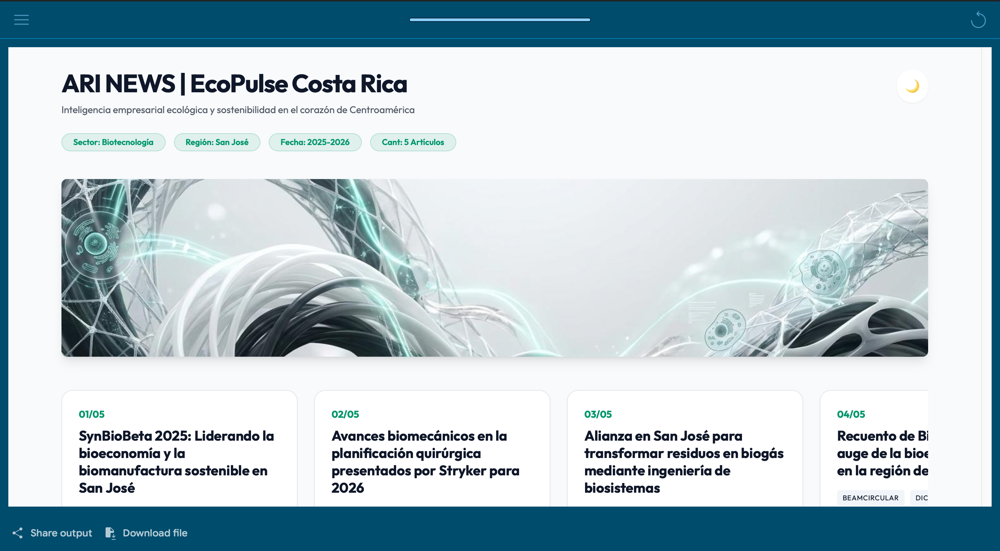
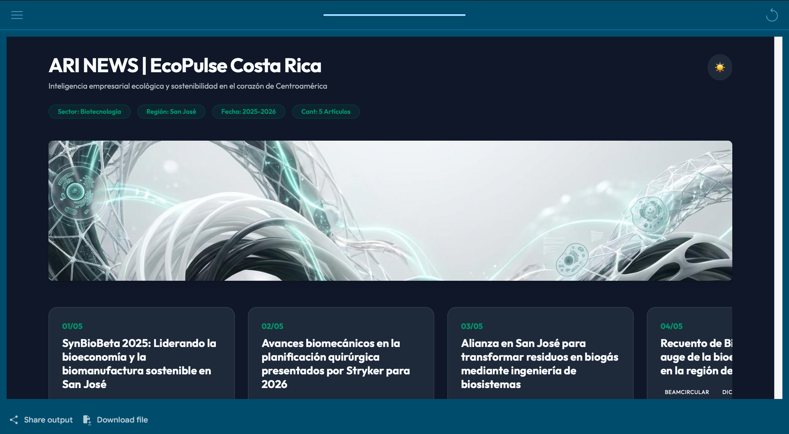
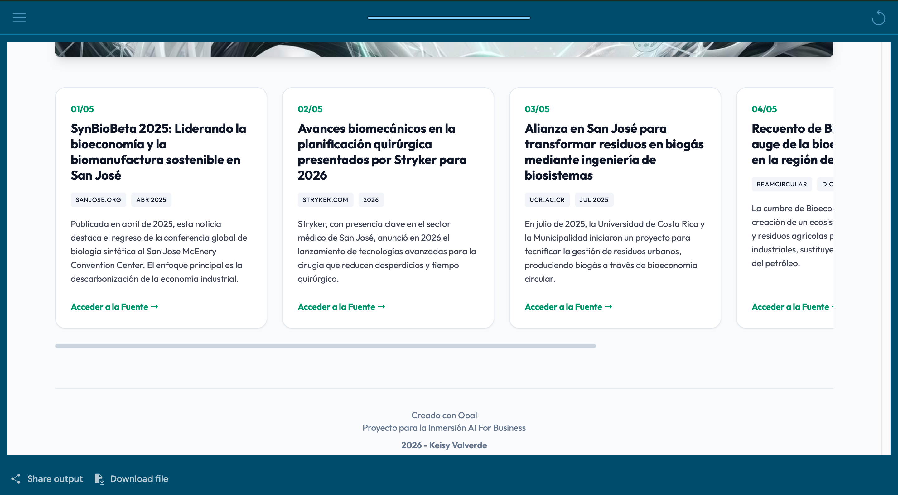
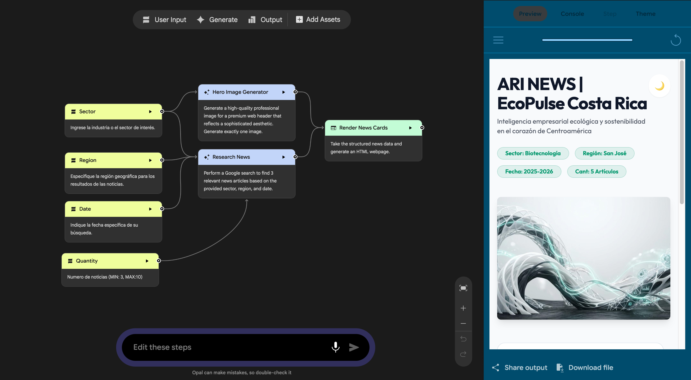

#  ARI NEWS: EcoPulse CR

> **Green Business Intelligence & Sustainability Dashboard**  
> *Desarrollado en Google Opal para la inmersión ONE AI For Business (2026).*


---

##  Descripción del Proyecto

**ARI NEWS: EcoPulse CR** es un dashboard web interactivo diseñado para actuar como un radar táctico de inteligencia verde para negocios. La plataforma procesa búsquedas de noticias en tiempo real sobre sostenibilidad, energías limpias e innovación ambiental, presentando la información bajo una interfaz con estética **Premium Sustainable Editorial**.

El proyecto combina lógica de inteligencia artificial generativa, arquitectura de nodos en **Google Opal** y principios de desarrollo **Front-End** y **Diseño Gráfico** para ofrecer una experiencia de usuario limpia, responsiva y adaptable.

## Vista previa del proyecto

### Interfaz de usuario

**Vista principal**



**Modo oscuro**



**Resultados de noticias**



### Arquitectura del workflow

El siguiente diagrama muestra el flujo de trabajo desarrollado en Google Opal y la conexión entre los nodos que componen ARI NEWS: EcoPulse CR.



---

##  Características Clave

*  **Inputs Configurables:** Permite personalizar la búsqueda por Sector (*Energías Renovables, Biotecnología, Movilidad Eléctrica, Economía Circular, Agricultura Sostenible*), Región (*Costa Rica, América Latina, Global*), Fecha de corte (`AAAA-MM-DD`) y Cantidad de noticias (3 a 10).
*  **Generación de Imagen Hero (Nodo 7):** Banner conceptual abstracto creado con IA según el sector seleccionado, sin texto visible.
*  **Modo Claro / Modo Oscuro:** Switch interactivo en JavaScript que conmuta paletas de colores, tarjetas, scrollbars y contraste sin recargar la página.
*  **Layout Responsive & Scroll Horizontal:** Navegación fluidizada mediante carrusel CSS (`scroll-snap`) pensado para escritorios y dispositivos móviles.
*  **Formateo Seguro de URLs:** Generación dinámica de slugs para redirigir a búsquedas seguras en Google en pestañas independientes (`target="_blank"`).

---

##  Tecnologías y Herramientas

* **Plataforma AI:** [Google Opal](https://opal.google/) (Workflow de Nodos Multimodal)
* **Modelos & Grounding:** Gemini / Google Search Grounding & Imagen Generation
* **Front-End:** HTML5, CSS3 (Flexbox, Variables CSS, Webkit Scrollbars), JavaScript (Vanilla JS ES6)
* **Diseño UI/UX:** Paleta Charcoal (`#0F172A`), Pure White (`#FFFFFF`) y Emerald Accent (`#059669` / `#10B981`)

---

##  Arquitectura del Flujo (Opal Workflow)

El sistema opera mediante una arquitectura distribuida de nodos en Google Opal:

```text
[Sector] ────────+───> [Nodo 7: Hero Image Generator] ─────+
[Region] ────────|                                         |
[Date] ──────────+───> [Fetch News Articles] ────────────> [Render News Cards]
[Quantity] ──────┘
```

---

##  Autora

* **Keisy Valverde** — *Front-End Developer & Visual Designer*
* Proyecto presentado para la inmersión **ONE AI For Business** (2026).

---

## Reconocimientos

Este proyecto fue desarrollado como parte de la **Inmersión AI For Business**, una experiencia de aprendizaje de Alura Latam en colaboración con Oracle, orientada a la exploración de herramientas de inteligencia artificial y su aplicación en proyectos prácticos.

<p align="center">
  <a href="https://www.aluracursos.com/" target="_blank" rel="noopener noreferrer">
    
  </a>
  &nbsp;&nbsp;&nbsp;&nbsp;
  <a href="https://www.oracle.com/" target="_blank" rel="noopener noreferrer">
    
  </a>
</p>

<p align="center">
  <sub>Proyecto educativo creado por Keisy Valverde · 2026</sub>
</p>

---

##  Contacto

¿Tienes preguntas o sugerencias sobre el proyecto? Puedes contactarme por aquí:

- **Autora:** Keisy Valverde Amador
- **GitHub:** [@eivrde](https://github.com/eivrde)
- **LinkedIn:** [Keisy Valverde](https://www.linkedin.com/in/eivalverde/)
- **Email:** [eivalverdea@outlook.com](mailto:eivalverdea@outlook.com)
